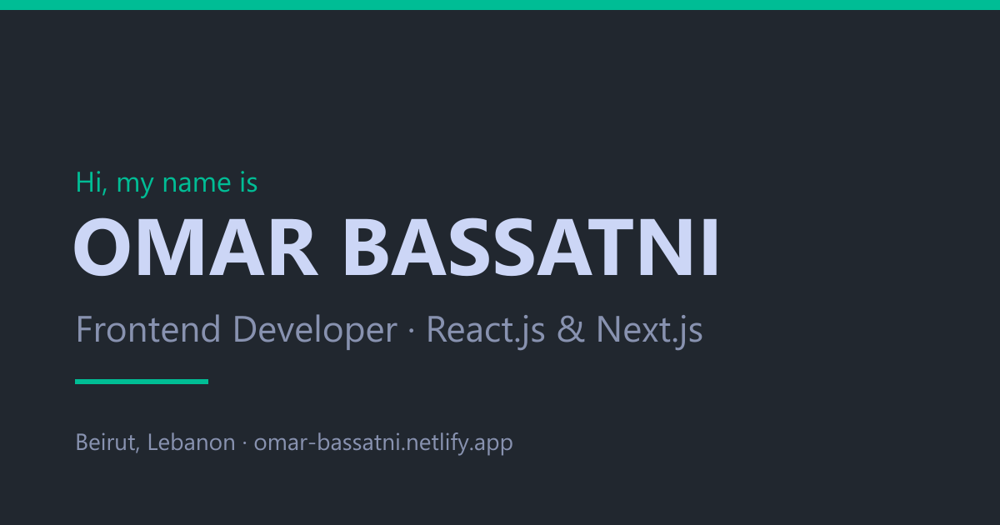

# Omar Bassatni — Portfolio

Personal portfolio of **Omar Bassatni**, a Frontend Developer specializing in React.js and Next.js, based in Beirut, Lebanon.

**Live site:** [omar-bassatni.netlify.app](https://omar-bassatni.netlify.app/)



## Sections

- **Home**: intro, CV download, and social links
- **About**: professional summary
- **Experience**: timeline of roles at Arabia Intelligence, ITXI, and Astudio
- **Skills**: technologies I work with
- **Work**: professional case study, freelance client projects, and earlier projects
- **Contact**: contact form (via Getform) and email

## Tech stack

- Next.js 16 (App Router, static export)
- React 19 and TypeScript
- Tailwind CSS
- Framer Motion (navbar animation and scroll progress bar)
- React Icons

## Running locally

```bash
npm install
npm run dev        # development server at http://localhost:3000
npm run build      # static export to /out
npm start          # serve the built /out folder locally
npm run typecheck  # TypeScript check
```

## Deployment

The site is exported as static files (`output: 'export'` in `next.config.ts`), so it can be hosted anywhere. [netlify.toml](netlify.toml) sets the Netlify build command and the `out` publish folder. Vercel detects the setup automatically.

## Project structure

```
src/
  app/          # layout (metadata, fonts), page, manifest, global styles
  components/   # one component per section, plus shared pieces (SocialLinks, Footer)
  data/         # experience, projects, and skills content
  lib/          # site links and the typewriter hook
  assets/       # images
public/         # resume PDF, social preview image, icons
```

Content lives in `src/data`, so updating the portfolio usually means editing data rather than components. Site-wide links (email, socials, resume, site URL) are in `src/lib/links.ts`.

## Contact

- Email: [omarbassatni@gmail.com](mailto:omarbassatni@gmail.com)
- LinkedIn: [omar-bassatni](https://www.linkedin.com/in/omar-bassatni-40a762188/)
- GitHub: [OmarBassatni97](https://github.com/OmarBassatni97)
